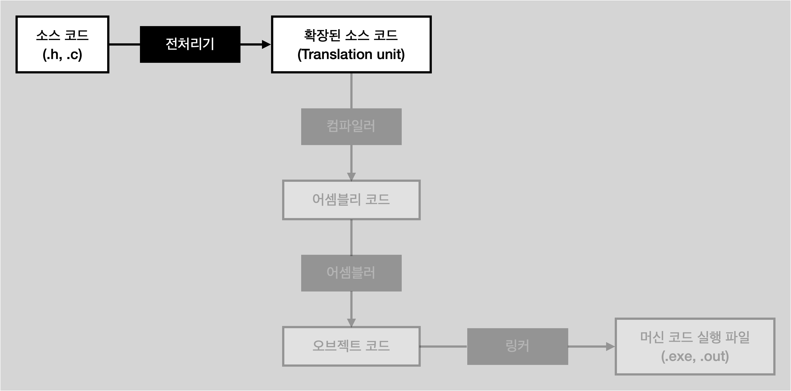

# Preprocessing (전처리 단계)

<li>보통 전처리기라는 별도의 프로그램이 담당</li>
 

## 전처리 단계

<li>C 파일 입력</li>
<li>주석 제거</li>
<li>매크로를 확장</li>
<li>include 파일들을 확장 : #include ".h" 를 지우고 그 자리에 헤더 파일 속 내용을 복사 붙여넣기</li>
<li>컴파일의 기본 단위인 확장된 소스 코드(translation unit) 출력</li>

 

## Translation unit

컴파일 플래그에 <code>-E</code> 플래그를 넣으면 결과 출력
