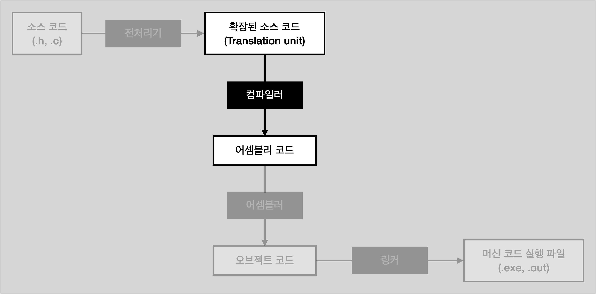

# Compilation (컴파일 단계)

<li>전처리 과정에서 출력된 트랜스레이션 유닛을 컴파일러가 어셈블리 코드로 변환해 주는 단계</li>
<li>컴파일러 라는 프로그램이 담당</li>
 

 

## 컴파일 단계

<li>트랜스레이션 유닛 입력</li>
<li>어셈블리어 코드로 출력 (기계어와 1:1 대응)</li>

 

<b>어셈블리어 코드는 아직 정의를 모르는 심볼(함수나 변수의 이름 등)을 사용할 수 있기 때문에 컴파일러가 어떤 함수나 변수의 정의를 못 찾을 경우 선언만 보고 일단 빈 공간으로 남겨놓고, 그 공간은 링크 단계에서 채운다.</b>

 

## Assembly language

<li>컴파일 플래그 -S 를 넣으면 어셈블리어 코드가 .s 파일로 저장</li>
<li>어셈블리어 코드가 나왔다는 의미는 이 단계 이후부터 코드는 특정 플랫폼에서만 동작한다는 의미</li>
<li>C가 크로스 플랫폼은 컴파일 전까지만 가능</li>
<li>또한 타겟 플랫폼이 몇 비트냐에 따라 C의 자료형 크기가 달라질 수 있는데, 따라서 어셈블리어 코드는 이미 그 자료형 크기가 결정된 후가 된다.</li>
