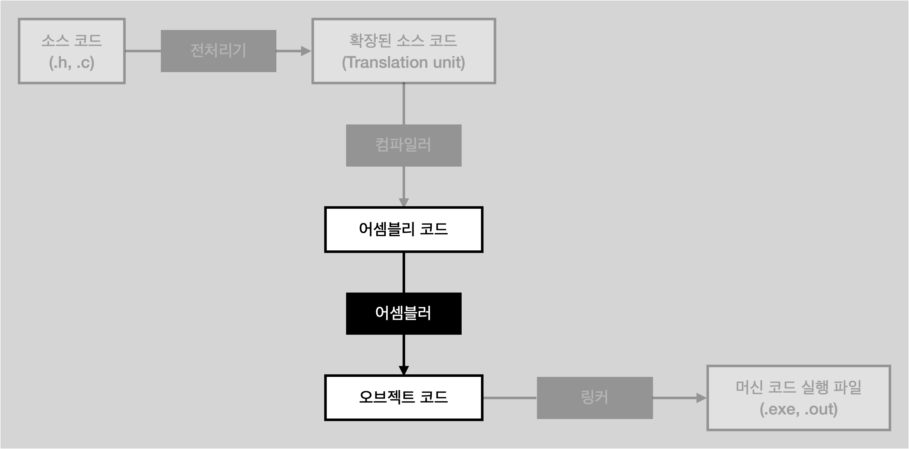

# Assembling

<li>어셈블리 코드를 받아 object 코드로 만듦</li>
<li>어셈블러가 담당</li>
 

 

## Object code

<li>기계가 곧바로 이해 가능한 기계 코드(machine code)</li>
<li>기계어(machine instruction), 이진 코드</li>
<li>어셈블리어 코드와 마찬가지로 나중에 채워야 하는 곳이 존재</li>
<li>컴파일 플래그 <code>-c</code> 를 넣으면 오브젝트 코드가 .o 파일로 저장</li>
