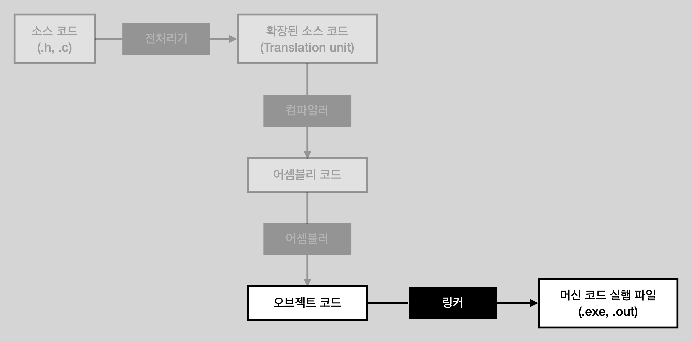

# Linking (링크 단계)

<li>오브젝트 코드를 받아 머신 코드 실행 파일(.exe, .out)로 만들어 주는 것</li>
 

## 링크 단계

<li>모든 오브젝트 코드들 입력</li>
<li>링커가 오브젝트 파일을 전부 모아서 하나의 이진 파일로 만들어 주는 과정에서 함수의 위치를 기억</li>
<li>함수를 호출하려는 코드(빈 공간)를 만나면 실행 위치에 그 호출 주소로 점프하는 코드를 넣어준다.</li>
<li>만약 선언만 믿고 사용한 함수나 변수가 여전히 빈 공간으로 남아 있다면 링커 오류(unresolved)를 반환</li>
<li>따라서 링커가 모든 오브젝트 코드들을 모아다 컴파일 단계의 빈 공간을 채운 후 실행 파일로 저장</li>
<li>최종 파일(.exe, .out) 출력</li>

## 링크 단계가 나뉘어 있는 이유

<li>컴파일러가 빈 공간을 남겨놓지 않고 채우면서 컴파일을 한다면? C 파일이 많이 있으면 빈 공간을 채우는 일이 매우 복잡하다. 예를 들어 C 파일이 10000개나 있다고 가정했을 때, 컴파일을 할 때마다 모든 함수를 찾아 채우기가 어렵다.</li>
<li>또, 빈 공간을 채우면서 컴파일이 되었다면, 여러 개의 C 파일에서 동일한 외부 함수를 사용할 경우 최종 실행 파일에 그 함수 정의가 중복으로 들어갔을 수 있다. 그렇게 된다면 함수 충돌이 날 수 있고 다시 중복 검사를 거치는 일을 해야한다.</li>
<li>따라서 빈 공간으로 남긴 후 링킹 단계에서 채우는 것이 빠른 방법이다.</li>

## 오브젝트 파일을 만드는 이유

<li>하나의 C 파일을 수정하는데 모든 C 파일을 새롭게 컴파일 하는 것은 비효율적이다. 따라서 변경할 필요가 없는 파일은 오브젝트 파일을 만들어 놓고, 새롭게 바뀐 파일만 오브젝트 파일을 다시 만들고, 기존의 오브젝트 파일과 합쳐 링크하는 게 더 효율적이다.</li>
